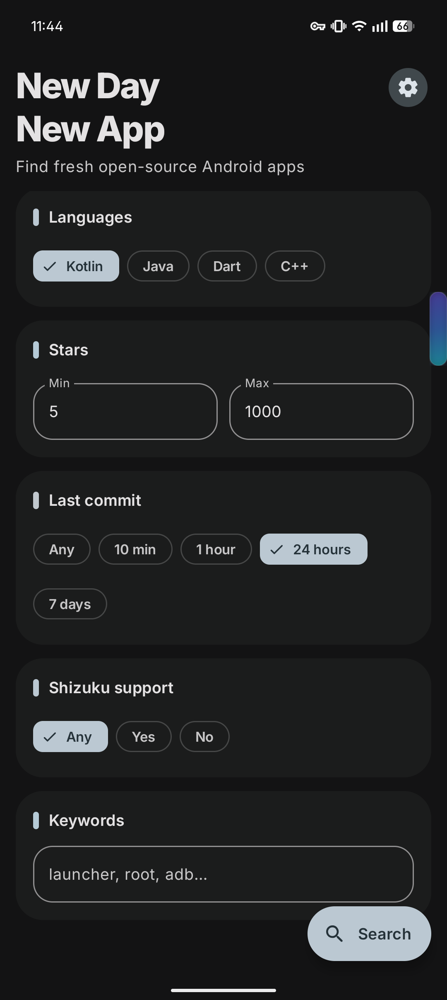

<p align="center">
  
</p>

<h1 align="center">NDNA</h1>

<p align="center">New Day New App, Find newly updated open source Android apps on GitHub.</p>

## What it does

NDNA searches GitHub for Android app repositories and shows the ones that match
a set of filters you control. It is aimed at finding small, actively developed
projects that are hard to spot through normal GitHub search.

Every search is restricted to Android projects. Repositories must mention
Android in their name, description or topics, and forks are excluded.

## Screenshots

<p align="center">
  
</p>

## Filters

| Filter | Description |
| --- | --- |
| Languages | Kotlin, Java, Dart and C++. Selecting more than one runs a separate search per language and merges the results. |
| Stars | Minimum and maximum star count, so you can exclude both abandoned and already popular projects. |
| Last commit | How recently the repository was pushed to: 10 minutes, 1 hour, 24 hours, 7 days, or any. |
| Shizuku support | Require, exclude, or ignore repositories that mention Shizuku. |
| Keywords | Free text added to the query. Matching words are highlighted on each result. |

Results are sorted by the most recent push and open in the browser when tapped.

## GitHub token

The app works without a token, but unauthenticated GitHub search allows only
10 requests per minute, which is quickly used up when several languages are
selected. Adding a personal access token raises this to 30 requests per minute.

To add one, open Settings in the app and paste a token. No scopes are needed
for public repository search. The token is stored with EncryptedSharedPreferences
and is only ever sent to api.github.com.

The app reads GitHub's rate limit headers and blocks further requests until the
limit resets, rather than failing repeatedly.

## Building

Requires JDK 17 and Android SDK 37.

```
./gradlew assembleDebug
```

The APK is written to `app/build/outputs/apk/debug/`.

Minimum supported Android version is 11 (API 30).
